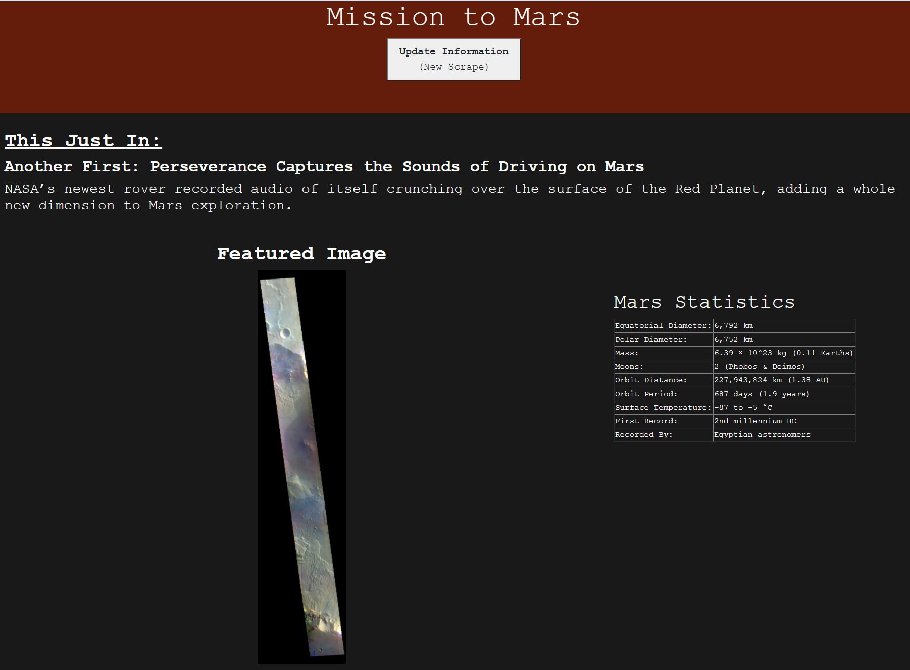
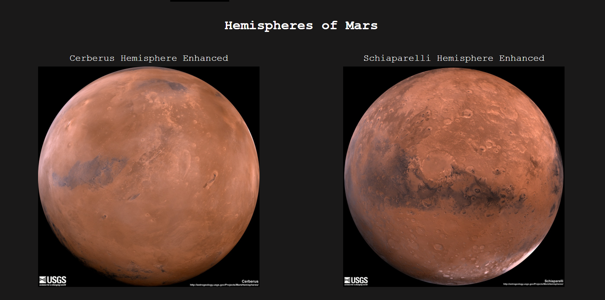
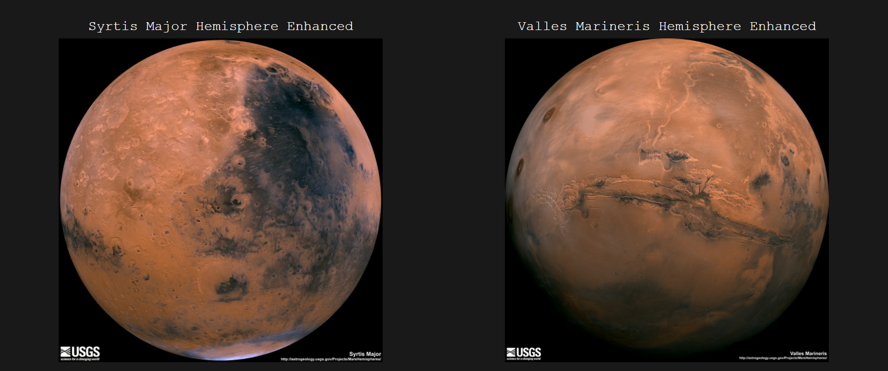

# Web Scraping: Mission to Mars

This project involved building a web application that scrapes various websites for data related to to the Mission to Mars and displays the information in a single HTML page.

## Step 1 - Scraping

Initial scraping was completed in Jupyter Notebook using BeautifulSoup, Pandas, and Requests/Splinter.

* Create a Jupyter Notebook file called `mission_to_mars.ipynb` and use this to complete all of your scraping and analysis tasks. The following outlines what you need to scrape.

### NASA Mars News

* Beautiful Soup was used to scrape the [NASA Mars News Site](https://mars.nasa.gov/news/) and collect the latest News Title and Paragraph Text. The text was assigned to variables for later reference.

### JPL Mars Space Images - Featured Image

* Next, the JPL Featured Space Image was scraped from the [JPL Site: Featured Image](https://www.jpl.nasa.gov/spaceimages/?search=&category=Mars).

* Splinter was used to navigate the site and find the image URL. The URL for the full-size '.jpg' item was assigned to a variable called `featured_image_url`.

### Mars Facts

* Then, Pandas was used to scrape the table containing Mars Facts on the [Mars Facts webpage](https://space-facts.com/mars/). 

* Pandas was used to convert the data to a HTML table string.

### Mars Hemispheres

* Using loops, the code was set up to visit the [USGS Astrogeology site](https://astrogeology.usgs.gov/search/results?q=hemisphere+enhanced&k1=target&v1=Mars) to obtain high resolution images for each of Mars' hemispheres.

* The image URL string for the full resolution hemisphere image and the Hemisphere title containing the hemisphere name were saved and stored in a Python dictionary. 

* Each dictionary with the image URL string and the hemisphere title were appended to a list containing one dictionary for each of the four hemispheres.

- - -

## Step 2 - MongoDB and Flask Application

In this portion, used MongoDB with Flask templating to create a new HTML page that displays all of the information that was scraped from the URLs above.

* The Jupyter notebook was converted into a Python script called `scrape_mars.py` with a function called `scrape` that executes all of the scraping code from above and returns one Python dictionary containing all of the scraped data.

* A route was created called `/scrape` that imports the `scrape_mars.py` script and calls the `scrape` function.

  * The returned value was stored in Mongo as a Python dictionary.

* A root route `/` was created that queries the Mongo database and passes the Mars Data into an HTML template to display the data.

* A template HTML file called `index.html` was created that takes the Mars Data Dictionary and displays all of the data in the appropriate HTML elements. 

